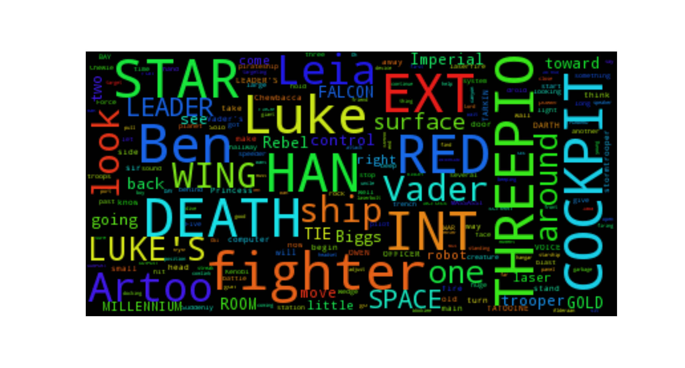

# How to do a Data Science Project 

Throughout the history of this organization we have emphasized the importance of creating projects. The biggest issue that we've seen people face is that they want to do a project but they don't know how to start a project. This roadblock prevents people from moving forward and will often make or break a team. 

To put it bluntly we can't let this slide anymore. We hope with this newly formatted **Project Group** to bridge the gap and make doing a project an attainable goal. 

## Why do a Data Science Project?
 
Before we go into the technical details of building a Data Science Project, we want you to ask yourself: Why do you want to do a Data Science Project?

People's motives will vary. Answers can range from: '*it will look good on my resume*', '*I want to be able to brag about something that's attainable by other people online*', '*I want to learn beyond what's taught to me in my classess*'. 

Whatever the reason for your attendance in this group, you will realize that you are now connected to a community that aims to enter a newly emerging field in need of highly driven and analytical people with a love for all things data.

The short answer for the desired results for a Data Science Project  is that you want to predict an outcome based on certain attributes. Doing a Data Science Project will make sense of your data which you can then use for a plethora of insights relating to your understanding of the data which you can then use to give insight to people who need it or are curious as to how the *data speaks to you*. 

### Open Source
Once you start the process of a Data Science project you will quickly be introduced to the concept of *open-source* (if you haven't already). This concept was introduced to me through **R/Rstudio** and I quickly fell in love with *open-source*. Once you have learned the tools and have published a project, using **RStudio** or **Python**, you can publish to [inertia7](http://www.inertia7.com/) or your GitHub Repo, but you will realize that you have made your imprint unto this growing community where anyone can learn from you if they so choose to! 

Here I've provided a (non-exhaustive) list of *open-source* communities that provide resources at any skill level for people wanting to enter this field:

- [RBloggers](https://www.r-bloggers.com/)
- [Stack Overflow](http://stackoverflow.com/)
	- [Cross Validated](http://stats.stackexchange.com/)
- [Kaggle](https://www.kaggle.com/)

We can go on and on about resources, but regardless of how many resources we provide, people will still be left with an air of mystery as to what exactly a Data Science Project is. So the next section aims to dissect the process of doing a Data Science Project, and provide more resources at every step. 

## Getting the Data

We are assuming that for you to have gotten this far you have a basic understanding of some statistical tools/methods and are fairly knowledgeable with either **R**/**Python** as your tool for project building (granted we don't expect you to be experts on either but knowing how to manipulate data frames, conditional formatting, and data wrangling are a must to do projects).

This part of the project building can be daunting due to the over-abundance of data sets/raw data. 

This step requires more thought than one might think, and will ultimately be decided as to what your team is interested in. This can range from sports, video games, music, etc. If it exists there is data available for it. And if there isn't then you can be the first to collect data (more on this later!)

Now if you're a beginner we recommend using data sets that have are *open-source* and have been used before for Data Science projects. 

This can range from:
- [UCI Machine Learning Repository](https://archive.ics.uci.edu/ml/datasets.html) 
- Data sets found in the **RStudio** base packages found here: http://stat.ethz.ch/R-manual/R-devel/library/datasets/html/00Index.html. 
- If you have a bit more experienced then we would definitely recommend the [Kaggle Data sets](https://www.kaggle.com/datasets)
- API Calls to certain websites like **Twitter**, **Reddit**, **Google Maps** to name a few.

A piece of advice when choosing a data set, when starting off, is to choose one that isn't to over the top. The best way to learn is to go through a simple data set and then expand what you learned unto more complicated data sets once you become familar with the process. For many of our projects in inertia7.com we chose data sets that were often used in our Statstical Classes and online resources, that we mentioned, to slowly build up our repertoire and skill set. 

Start small and build your way up

## Data Wrangling

This part varies from data set to data set. Once you have chosen your data set/collected your data, the next step is the process of cleaning the data known as *Data Wrangling*. If you have chosen a data set that has been abundantly used in statistical courses/Online Data Science resources you will find that you can easily reference other people's work when it comes to cleaning your data set(**Remember to Cite every source you use**). As well as finding justifications readily available for the transformations that were made.  

This step is crucial; often we take for granted the data sets we use, but one will find that data sets are often very messy and it is up to you to go through the process known as *Data wrangling*. 

### Example: Normalization of our predictor variables
Often in machine learning, we will realize that the different variables are measured in different scales. 

For example say we have a data set that has these two columns: 

- `Spending` - measured in percentage (i.e. 13.56% is written as 13.56)
- `CostPerCapita` - measured in $1 millions (i.e. $1.3 million is written as 1,300,000) 

If we tried to do some models on this data set without transforming our data we will quickly run into some critical errors that will hinder our results. Thus possibe solution is to scale our data so that the **mean** for both our variables is 0 and the **standard deviation/variance** is 1. 

This process is known as **Normalization**.

This is one of many processes that one should take into consideration before delving into a Data Science Project. 

Say you've gotten this far and quickly realized that you don't know when and when not to do transformations to your data set. This process does require a bit of analytical intuition, and there are many resources online that can help with the process. 

Let's pause the process here and say you don't think you have the skill set to make these important decisions. This is important to admit because if you are stuck here and you don't know how to continue a project, this can put a project on pause indefinitely. 

Our advice to you is not to be discouuraged, let's just take a step back and not necessarily redesign your project, but essentially work with what you have. 

## Data Visualization
Something many people take for granted is *Data visualization* when going about Data Science Projects. Known as **Exploratory Analysis**, visuals are an important factor of projects because it helps gain readers that are interested in what the data has to say in, usually people who don't have a strong data based background. As you progress on to more complicated projects the visualizations will take a back seat to the analystical aspect of your project, but if you're a beginner visualizations are a powerful tool to lure other beginners and a wide array of people into reading your project no matter how simple or trivial you might think it is. 

An example of this being a subreddit called [Dataisbeautiful](https://www.reddit.com/r/dataisbeautiful/) currenlty followed by 9,616,736 redditors. This subreddit focuses on simple visualizations of data collected by redditors. Many of these projects do not feature machine learning or advanced statistical inferences, but there's a reason it has so many followers. 

Many people who do not posess the data-driven background still love to learn about data presented to them in a way they can understand, and a visualization is just that. 

## Example: Exploratory Analysis on Text
An example of an effective use of visualizations would be say your team decided to do text analysis on the movie script for **Star Wars: A New Hope** through the process known as **Natural Language Process** (NLP), but the algorithms you found online don't make sense you're team and you're having trouble moving forward. Instead of letting the project come to a complete halt, instead think of some easy descriptive statistical methods you can employ on your data set. 

WordClouds are a simple and effective way of showcasing words that are often said in a corpus, in our case the movie script. Employing the [Word_Cloud](https://github.com/amueller/word_cloud) module in **Python** you can quickly reignite fire to your project as shown below (This process took me all but 5 minutes to recreate using their sample scripts on GitHub):

From here many other ideas come to mind that don't involve complicated machine learning algorithms:

- Bar chart showcasing the amount of dialogue each character has
- Word Clouds for each main character
- Bar Charts showcasing frequency of a certain word like **the Force**

Therefore we showcased that Data Science projects don't have to be overtly complicated, starting with exloratory analysis is okay and can be used as a jumping board to more complicated and indepth analysis. 